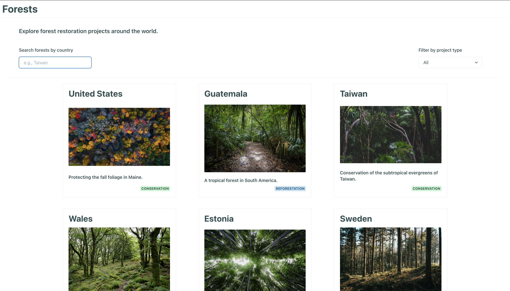
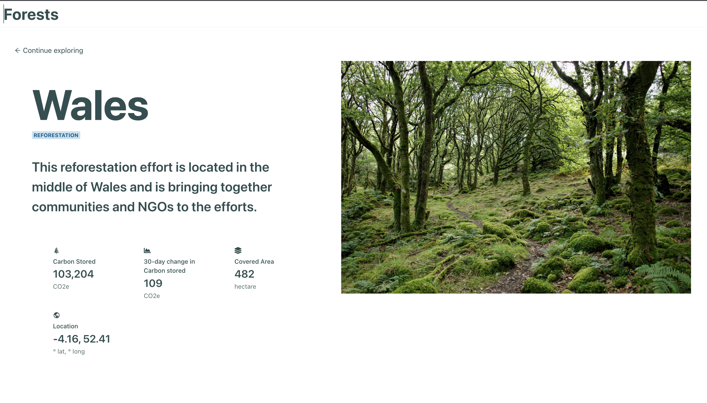

# Forests

Explore forest conservation efforts around the world!

 

    
    

 

A minimal React / Chakra UI / Vite web app with little forest project placeholders stored in a Postgres database served by a FastAPI REST API.

## Run the Forests Platform

`docker-compose up`

(Tested w/Docker Destop v4.1.1 for Apple Silicon Mac)

The web application runs at http://localhost:3000, the API at http://localhost:8000, and the database at http://localhost:5432.

### Features

- View a paginated directory of forests
- Click on a forest to see details
- Search for forests by country name
- Filter by forest project type (conservation, reforestation)
- Responsive design - made with mobile in mind
- Rudimentary null handling/routes

## Stack

### Frontend

- React
- TypeScript
- Vite
- Vitest
- Playwright
- Chakra-UI

Chakra-UI was selected for the frontend components. I started with Tachyons but switched to Chakra-UI due to limited time/more accessibility support out of the box.

### Backend

- Postgres
- Alembic
- SQLAlchemy
- FastAPI

Postgres was selected due to its extensibility to support geospatial (e.g., GeoJSON/PostGIS) data - which future iterations of this platform greatly benefit from!

SQLAlchemy is used for schema/model definitions and Alembic is used to apply migrations.

In retrospect a lighter database like SQLite or even Redis etc. could have done the job abit quicker here.

## Design Process and Tradeoffs

### Design Process

A compressed design/implementation process was applied for this little project. This entailed:

1. Enumerating requirements
2. Mapping out architecture
3. Sketching out rapid design by hand then Figma (didn't end up using)
4. Implementing the backend (db + API)
5. Implementing the frontend
6. Refining frontend for responsiveness

### Tradeoffs/Areas to improve

The biggest challenge for this platform was rapidly adding all the required features. And due to time constraints, significant tradeoffs were made. With more time, I would look to especially improve upon the following items:

#### Responsiveness

UI is reasonably responsive for mobile but I would take a step back and focus on building out a better global theme rather than applying hacky particular CSS props iteratively.

#### Performance

The database `get_forest` endpoint queries by `forest_country` which is silly. In production a more effective primary key, such as UUID should be used instead.

Additionally the loading animations on the UI are a bit rough. With more time I would thoughtfully apply the <Skeleton /> components and use more semantically appropriate reducers to represent async REST API `loading`, `error` etc. states.

#### Tests

While all the pieces are there to apply tests (e.g., Vitest and Playwright), I chose not to prioritize tests in order to add more of the features called for in the assignment. I would definitely remedy that ASAP.

#### Data Models

Semantically related data (e.g., locations encompassing latitude / longitude, health metrics being grouped) should be used (instead I have a single `forests` table with flat keys). I was a bit rusty on SQLAlchemy and couldn't quickly figure out the syntax for modeling nested relationships, so that would be a quick fix in the 
future (then I would use multiple tables w/a forest's UUID as a foreign key). This would extend well into transitioning over into formal geospatial types/PostGIS and more complex data structures.

#### Pagination

While I implemented pagination on the backend, I didn't have sufficient time to add the controls on the UI. So I would do that next.

#### Roadmap

For this hypothetical platform, some of the features that come readily to mind from here would be:

- Geospatial support to show forest projects on a globe (e.g., PostGIS, Mapbox)
- More granular project tags/filters (e.g., additional project types, query by location, etc.)
- ...and more!

#### Scalability

To deliver **Forests** to 1,000,000 concurrent users around the world, I would do the following, or similar:

- Either host the web application serverlessly w/AWS Lambda functions, or even just statically on AWS S3 w/a CDN with an intelligent caching policy
- Potentially write a GraphQL server/client to reduce overfetching from my FastAPI REST API
- Use AWS RDS PostgreSQL instances w/autoscaling
- Potentially use Kubernetes/AWS EKS or ECS or Batch to scale out any compute services that **Forests** may grow to need on the backend
- etc...

### Final Thoughts

Thanks for exploring **Forests**! It was lots of fun to make.
